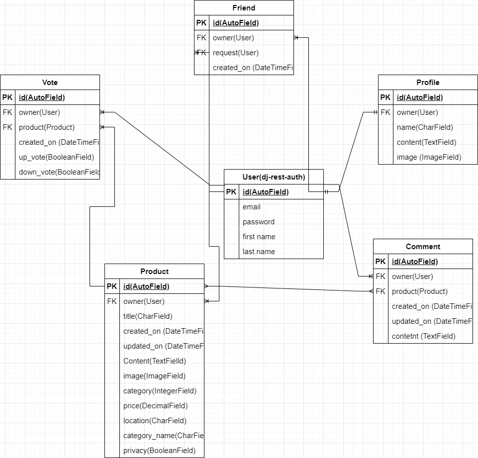

## Data Model
- The profile has a one-to-one relation with the User model and because of the signal a user object is created when a profile is created.
- The User model has a one-to-many relationship with the Friend model as one user can have many friends.
- The User model has a one-to-many relationship with the vote model as a user can have many votes on multiple posts.
- The User model has a one-to-many relationship with comments as a user can have multiple comments.
- The User model has a one-to-many relationship with the product as a user can have multiple products related posts.
- The Product has many-to-one relations as one product post can have many comments.
- The Product model has a one-to-many relationship with the vote as one product post can have many votes.

The database schema is available below.

Versus Database Schema

