# Testing

## Table of Contents

## Validator Testing

### HTML

Web site was run through [W3C HTML Validator](https://validator.w3.org/). The result can be seen below.

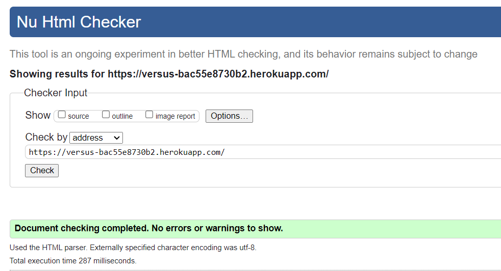

### CSS
[W3C CSS Validator](https://jigsaw.w3.org/css-validator/) found no error in the CSS files. The result can be seen below.

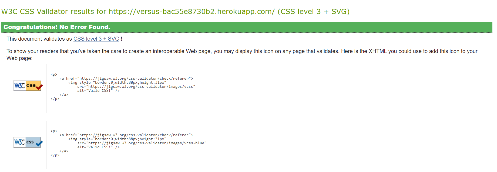

### Lighthouse Report
Deployed project was run through Lighthouse on Goggle Chrome.

- Home Desktop

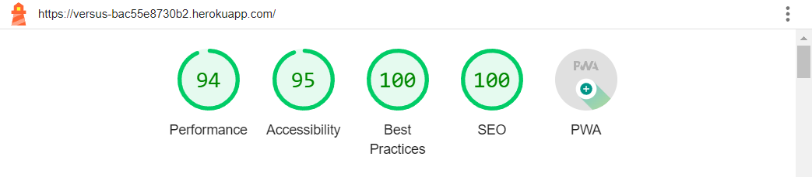

- Home Mobile

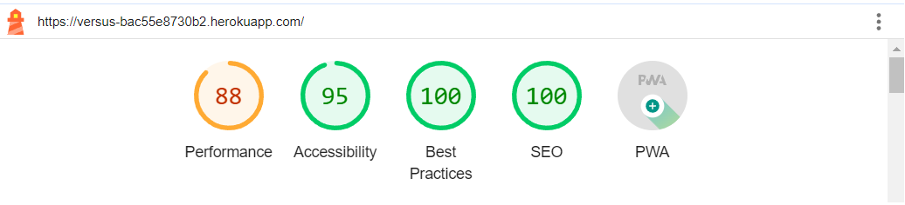

- Add Post Desktop

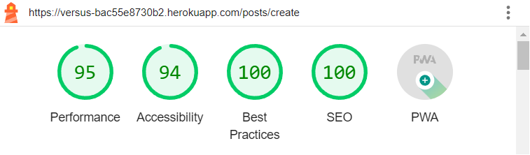

- Add Post Mobile

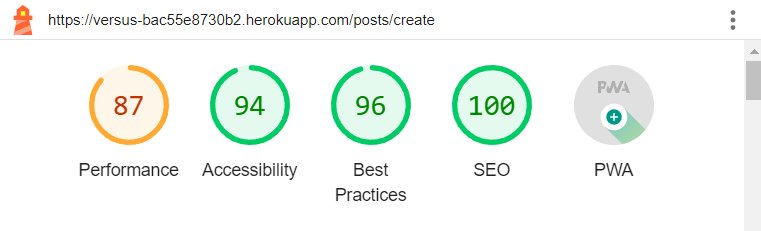

- Edit Post Desktop

- Edit Post Mobile

- Trending Desktop

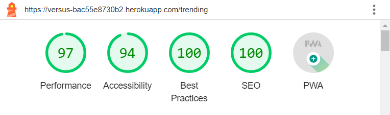

- Trending Mobile

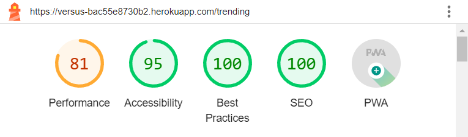

- Voted Desktop

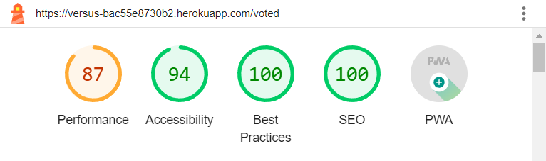

- Voted Mobile

- Profile Desktop

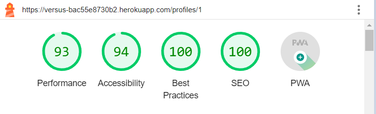

- Profile Mobile

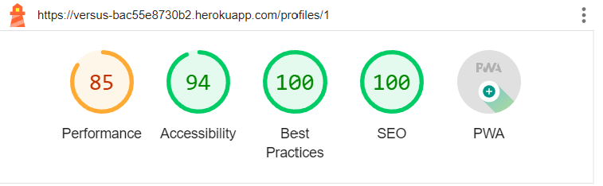

#### Posts Page

#### Trending

#### Voted

#### Profile

[Back to top](#top)