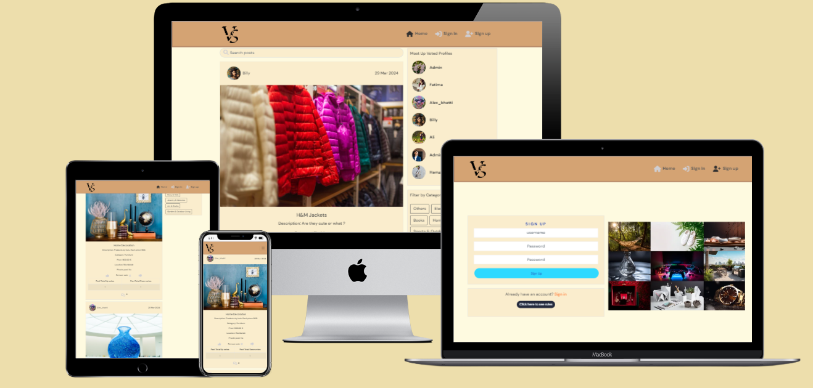

# Versus

Versus is a product comparison website where users can post items to find out more about them from other users' points of view.

On this platform, users can show their passion for how they feel towards specific products. They can upvote or downvote it or indulge themselves in discussing these products.

So, to enjoy full features simply register yourself and sign in to the world of Versus.

<!--  -->

The live site can be found here - [Versus](https://versus-bac55e8730b2.herokuapp.com/)

## Table of Contents

<small><i><a href='http://ecotrust-canada.github.io/markdown-toc/'>Table of contents generated with markdown-toc</a></i></small>

## User Experience (UX)
A visitor to Versus is most probably someone who wants to buy a product and post that product just to find what others think about that product, is it worth buying or if that product information is already there that visitor could get exact information by viewing the post.

### EPIC: User Profiles
The milestone is about user profiles. Their number of up/down votes, number of posts and all the posts.
#### User Stories
- As a user, I can see users' profiles so that I can see users' posts, their votes and their posts specifically know more about them.
- As a user, I can click three dots on my profile page so that I can select the change I want to apply to my profile.
- As a user, I can edit my profile so that I can change my profile image and add a bio.
- As a user, I can change the username so that I am known by a different name when other users see my profile.
- As a user, I can change my password so that I can upgrade the security of my profile.

### EPIC: Home Posts Page, Trending and Voted
A list of posts will be shown on this page and users will be able to search for posts based on title, username, price, and category. Almost the same tasks will be performed on these three pages. A list of popular profiles based on the highest number of upvotes can also be seen.
#### User Stories
- As a user, I can view all the most recent posts so that I am up to date with the newest content.
- As a user, I can search posts based on price, location, date, title, content, and category so that I can find the posts I am looking for.
- As a user, I can keep scrolling for new posts so that I can keep getting new information for myself without interruptions.
- As a user, I can click voted on the navbar on the home page so that I can view the posts again on which I have voted.
- As a user, I can see and click profiles on the home page with the highest number of upvotes so that I can see what they are posting, and see their content and profile data.
- As a user, I can view the posts that are trending so that I can be up to date with products that are trending in the market.

### EPIC: Post Page
This epic handles a single post data and content in it such as votes, comments, and image profile of the user who posted it.
#### User Stories
- As a user, I can view single post data so that I can view all the data related to it.
- As a user, I can vote on posts so that I can vote for best or worst products.
- As a user, I can update and delete posts by clicking on the top right corner of posts that belong to me so that I can modify posts as needed.
- As a user, I can edit my post so that I can update the data of my posts as I see fit.

### EPIC: Users Comments
The user can comment on posts, and edit or delete their comments. The user is also able to view other post
#### User Stories
- As a logged-in user, I can add comments to a post so that I can share my thoughts about the post.
- As a user, I can view all the comments so that I can observe what others think of the post or what others are talking about.
- As a user, I can keep on scrolling comments so that I can view all user comments.
- As a user, I can update and delete comments by clicking on the top right corner of comments that belong to me so that I can modify comments as needed.

### EPIC: Create Post
Users can create posts in which they can add an image, content add a post title set its category and price.
#### User Stories
- As a user, I can create or cancel a creation of post so that I either share a new post with others or cancel the post if I change my mind about it.
- As a user, I can add a title to a post so that others can read what the product is.
- As a user, I can add content for a post so that others can read what the product is in detail.
- As a user, I can select the category of the post that best defines it so that others can understand which category the product belongs to.
- As a user, I can upload an image in a post so that others can upvote/downvote by viewing it.

### EPIC: User Navbar
Users can interact with the nav bar icons and redirect to other web pages. Users can also sign out by clicking its icon.
#### User Stories
- As a user, I can be redirected to sign up so that I can create a new account for the Versus app and start using all features.
- As a user, I can see and click my profile picture so that view which accounts I am logged in from and view/edit it when I want.
- As a user, I can switch between nav items so that I can navigate to different sections of the website.
- As a user, I can view the current feed and the votes I have given on the products so that observe the current situation of the products and my status of votes on products I have voted.
- As a user, I can add a post by clicking on the add post option on the navbar so that I can create new posts of products and people can upvote/downvote them.
- As a user, I can sign in and out so that I can see my data or browse the app and sign out when I no longer want to use the application

### EPIC: Sign-in/ Sign-up
This milestone covers Signup/ Sign-up.
#### User Stories
- As a user, I can sign up so that I can post products and get people to vote on them and also vote on other people's products
- As a user, I can sign in so that I can view the latest posts or add new posts.

## Agile Methodology
GitHub Projects was used to manage the development process using the agile approach. To ensure streamlined organization, all User Stories were grouped into Milestones, representing the corresponding Epics, following the MOSCOW prioritization technique. For a comprehensive overview of the project's progress and workflow, I invite you to explore our dynamic Kanban board. [here](https://github.com/users/MBilalQureshi/projects/8).

The user stories seen above are based on the items mentioned on the project board.