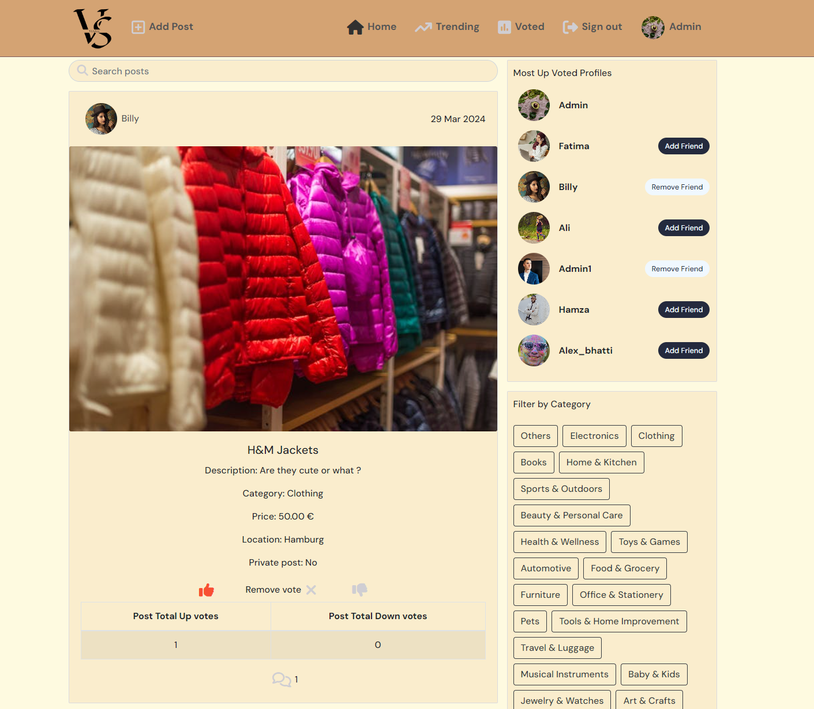

# Versus

Versus is a product comparison website where users can post items to find out more about them from other users' points of view.

On this platform, users can show their passion for how they feel towards specific products. They can upvote or downvote it or indulge themselves in discussing these products.

So, to enjoy full features simply register yourself and sign in to the world of Versus.

<!--  -->

The live site can be found here - [Versus](https://versus-bac55e8730b2.herokuapp.com/)

## Table of Contents

<small><i><a href='http://ecotrust-canada.github.io/markdown-toc/'>Table of contents generated with markdown-toc</a></i></small>

## User Experience (UX)
A visitor to Versus is most probably someone who wants to buy a product and post that product just to find what others think about that product, is it worth buying or if that product information is already there that visitor could get exact information by viewing the post.

### EPIC: User Profiles
The milestone is about user profiles. Their number of up/down votes, number of posts and all the posts.
#### User Stories
- As a user, I can see users' profiles so that I can see users' posts, their votes and their posts specifically know more about them.
- As a user, I can click three dots on my profile page so that I can select the change I want to apply to my profile.
- As a user, I can edit my profile so that I can change my profile image and add a bio.
- As a user, I can change the username so that I am known by a different name when other users see my profile.
- As a user, I can change my password so that I can upgrade the security of my profile.

### EPIC: Home Posts Page, Trending and Voted
A list of posts will be shown on this page and users will be able to search for posts based on title, username, price, and category. Almost the same tasks will be performed on these three pages. A list of popular profiles based on the highest number of upvotes can also be seen.
#### User Stories
- As a user, I can view all the most recent posts so that I am up to date with the newest content.
- As a user, I can search posts based on price, location, date, title, content, and category so that I can find the posts I am looking for.
- As a user, I can keep scrolling for new posts so that I can keep getting new information for myself without interruptions.
- As a user, I can click voted on the navbar on the home page so that I can view the posts again on which I have voted.
- As a user, I can see and click profiles on the home page with the highest number of upvotes so that I can see what they are posting, and see their content and profile data.
- As a user, I can view the posts that are trending so that I can be up to date with products that are trending in the market.

### EPIC: Post Page
This epic handles a single post data and content in it such as votes, comments, and image profile of the user who posted it.
#### User Stories
- As a user, I can view single post data so that I can view all the data related to it.
- As a user, I can vote on posts so that I can vote for best or worst products.
- As a user, I can update and delete posts by clicking on the top right corner of posts that belong to me so that I can modify posts as needed.
- As a user, I can edit my post so that I can update the data of my posts as I see fit.

### EPIC: Users Comments
The user can comment on posts, and edit or delete their comments. The user is also able to view other post
#### User Stories
- As a logged-in user, I can add comments to a post so that I can share my thoughts about the post.
- As a user, I can view all the comments so that I can observe what others think of the post or what others are talking about.
- As a user, I can keep on scrolling comments so that I can view all user comments.
- As a user, I can update and delete comments by clicking on the top right corner of comments that belong to me so that I can modify comments as needed.

### EPIC: Create Post
Users can create posts in which they can add an image, content add a post title set its category and price.
#### User Stories
- As a user, I can create or cancel a creation of post so that I either share a new post with others or cancel the post if I change my mind about it.
- As a user, I can add a title to a post so that others can read what the product is.
- As a user, I can add content for a post so that others can read what the product is in detail.
- As a user, I can select the category of the post that best defines it so that others can understand which category the product belongs to.
- As a user, I can upload an image in a post so that others can upvote/downvote by viewing it.
- As a user, I must know the rules for adding a post so that I can add a post without any validation errors or interruptions.
- As a user, I can set posts to private and public so that public posts can only be seen by all and private posts can only be seen by friends.

### EPIC: User Navbar
Users can interact with the nav bar icons and redirect to other web pages. Users can also sign out by clicking its icon.
#### User Stories
- As a user, I can be redirected to sign up so that I can create a new account for the Versus app and start using all features.
- As a user, I can see and click my profile picture so that view which accounts I am logged in from and view/edit it when I want.
- As a user, I can switch between nav items so that I can navigate to different sections of the website.
- As a user, I can view the current feed and the votes I have given on the products so that observe the current situation of the products and my status of votes on products I have voted.
- As a user, I can add a post by clicking on the add post option on the navbar so that I can create new posts of products and people can upvote/downvote them.
- As a user, I can sign in and out so that I can see my data or browse the app and sign out when I no longer want to use the application

### EPIC: Sign-in/ Sign-up
This milestone covers Signup/ Sign-up.
#### User Stories
- As a user, I can sign up so that I can post products and get people to vote on them and also vote on other people's products
- As a user, I can sign in so that I can view the latest posts or add new posts.

## Agile Methodology
GitHub Projects was used to manage the development process using the agile approach. To ensure streamlined organization, all User Stories were grouped into Milestones, representing the corresponding Epics, following the MOSCOW prioritization technique. For a comprehensive overview of the project's progress and workflow, I invite you to explore our dynamic Kanban board. [here](https://github.com/users/MBilalQureshi/projects/8).

The user stories seen above are based on the items mentioned on the project board.

## Design
The design of this website is very simple yet elegant and the color scheme gives a very relaxing vibe to attract more users.

### Color Scheme
The color palette is generated using [COOLORS](https://coolors.co/).


The color scheme of the website gives a very good contrast after placing the main items on the web page and the main purpose of this color scheme is to give effect of an enthusiasm to the site users.

### Imagery
All the images are fetched from the Cloudinary database except sign-in and sign-up which are fetched from online sources. Read the credits for more details.

### Wireframes
<details>
<summary>Landing Page</summary>

The landing page shows public posts even when the user is still not logged in. Once logged in user can also view the most trending posts based on up votes and also voted section which contains all the posts on which the user had voted.


</details>

<details>
<summary>Product Post Page</summary>

All the data related to a single post is shown here and also once the user has logged in, the user can comment or vote on the post directly from here.
 

</details>

<details>
<summary>Add Post Page</summary>

Users can create a post on products via this page. Rules are also mentioned here.


</details>

<details>
<summary>Profile Page</summary>

User can make all sorts of changes to their profile from here once logged in. All the posts are also present here on the profile page.


</details>

<details>
<summary>Sign in Page</summary>

Users access all the features of the website once signed in via this page.


</details>

<details>
<summary>Sign up Page</summary>

New users can sign up from here to access the website all features.


</details>

## Testing

Testing and results can be found [here](/FRONTEND_TESTING.md)

## Security Features and Defensive Design

### Custom error 404 page:
Custom page 400 Bad request page is added in case the user tries to enter invalid URLs.

### Form Validation
- The submit button will not work unless all the fields are filled with proper data and warning signs will also appear if data is not valid or fields are empty.
- Based on the data entered, every form in the project will be validated before moving forward. Characters will only take characters, symbols and integers as input but only in their relevant fields.

## Features
### Header


#### Logo
- The logo is almost on the left side of the nav bar. The VS sign defines products posted on the site. It can be the best or the worst depending upon the votes.
- Users can switch to the home page by clicking it.
#### Navigation bar

### Home Page


- The home page contains a list of all the public posts if signed out.
- Once signed in, the user can see private posts as well if he/she is a friend of the user who had private posts.
- The home page also shows popular profiles who have the highest number of votes.
- Users can click on the category section to search for specific categories of products.
- Users cannot vote or comment on the posts if logged out.
- Users can vote and comment on posts once logged in.
- All the navbar items are clickable and the user can switch to it easily.
- Users can add friends directly from the home page.
- Users can see the profiles if he/she clicks on the profile avatar or name on top of each post.

### Search Bar


- The posts on the page are searchable based on the following
    - Title
    - Content
    - price
    - Category
    - Location.

- The posts are searchable on the following pages
    - Home
    - Trending
    - Category
    - Voted

### Most Up Voted Profiles


- This component shows profiles with the highest to lowest number of votes.
- Users can add/remove friends directly from here if logged in.
- Users can also see this section if logged out but the option of adding or removing friends is removed.
- Users can see the profiles if he/she clicks on the profile avatar. 

### Category List


- A list of categories can be seen here which are clickable.
- Users switch to the category page on a category is clicked from here.
- The Category section is here as an aid so that users can switch to posts based on specific categories.

### Add Post Page


- Users always have the option to set posts as private.
- Private posts are only visible to friends.
- An image size should not exceed 2 MB.
- The image can still be changed before posting.
- Users can add content to the post it can either be a product description or just if the user wants to ask something specifically about the post and wants others' opinions.
- Users must tell the price of the product.
- Users must also tell the location where this product is found in the post.
- Users must select a category of the product before posting.
- Users can cancel and go back to home.
- Users can create posts after all fields are filled by clicking Create Post.
- Users can also see the rules of creating a post by clicking post creation rules.

### Edit Post Page


- During Edit user had all the options mentioned in the add post page. All the fields of editing posts are set to actual post data.
    - Users always have the option to set posts as private.
    - Private posts are only visible to friends.
    - An image size should not exceed 2 MB.
    - The image can still be changed before posting.
    - Users can add content to the post it can either be a product description or just if the user wants to ask something specifically about the post and wants others' opinions.
    - Users must tell the price of the product.
    - Users must also tell the location where this product is found in the post.
    - Users must select a category of the product before posting.
    - Users can cancel and go back to home.
    - Users can create posts after all fields are filled by clicking Create Post.
    Users can also see the rules of creating a post by clicking post creation rules.

### Trending Page

- This page shows the content mentioned in the following
    - Search Bar
    - Most Up Voted Profiles
    - Category List
- Trending shows filtered posts based on all the posts that are trending with the highest number of upvotes.
- This page is only accessible to users who are signed in.

### Voted Page

- This page shows the content mentioned in the following
    - Search Bar
    - Most Up Voted Profiles
    - Category List
- The Voted page shows posts that the current user had voted on.
- The votes can either be negative or positive.
- This page is only accessible to users who are signed in.

### Profile Page

- This page shows the content mentioned in "Most Up Voted Profiles".
- The user Profile page has the following content
    - Avatar
    - Total posts
    - Total upvotes
    - Total down votes
    - User's bio
    - Option to edit profile
    - Option to change username
    - Option to change password
- Below all the profile-related data all the posts are also available.
- If the profile is related to other users editing the profile option is unavailable.
- If the profile is related to other users there is an add friend option available.
- Users can click on profile posts to switch to that specific post as well.
- Logged-in users can upvote or downvote from here as well.

### Edit Profile Page


- Once the user clicks on the edit profile page user can add the following to the profile
    - Profile image (This field is pre-populated if the profile picture already exists)
    - User's Bio (This field is pre-populated if the bio already exists)

### Change Password Page


- The logged-in user can change their password from here by entering a new password.
- The user must enter a new password again before confirming it

### Change Username Page


- The user can change the username by selecting it from the change username from the profile.
- The username should be unique.

### Comment Section

- Once the user clicks on a specific post, the user is redirected to that specific post.
- The user can comment on posts from here only if logged in.
- The logged-out users are not able to comment.
- Users can edit or delete comments from here

### Edit Comment

- The users can only edit their comments.
- The users can only delete their comments.
- The users edit their comments while remaining on the same page.

### Sign Up Page


- All new users can sign up from here to see all the features of the website.
- Users must provide their unique username.
- Users must enter a new password.
- Users must enter the password again before signing up.
- Users can see the rules here as well before signing up.
- All the data will be validated before proceeding.
- Once all data is validated user will be redirected to the sign-in page.

### Sign in Page


- Users must provide their unique username.
- Users must enter a new password.
- Once validated user will be redirected to the home page.

### Sign out Modal, Model # 1


- The logged-in user can sign out directly from the navbar.
- The user will be asked if the user is sure to sign out inside the modal.
- The user can press cancel to avoid signing out.
- The user can press signout and will be redirected to the home page.

### Post Creation Rules, Model # 2


- There is a specific set of rules to follow before posting. All users must follow it.
- The user can click on the "Post creation rules" button to see all the rules.
- The user can click close or cross button to close the modal.

### Website rules modal on Sign Up,  Model # 3

- There is a specific set of rules to follow before signing up. All users must follow it.
- The user can click on the "Click here to see rules" button to see all the rules.
- The user can click close or cross button to close the modal.

## Libraries and Technologies Used
### Languages
- Python
- HTML
- CSS
- Javascript

### Frameworks - Libraries - Programs Used
- [ReatJS](https://react.dev/)Front-end JavaScript library for building user interfaces based on UI components.
- [React Bootstrap](https://react-bootstrap.github.io/) is a component-based library that provides native Bootstrap components as pure React components. Used to create a responsive application/component UI.
- [GitHub](https://github.com/) is used to host the repository and agile tool.
- [GitPod](https://gitpod.io/) is used to develop project and organize version control.
- [Heroku](https://www.heroku.com/) used to deploy the live project.
- [PEP8 Online](https://pep8ci.herokuapp.com/#) used to validate all the Python code.
- [Google Fonts](https://fonts.google.com/) is used to change the fonts of the project.
- [W3C](https://www.w3.org/) - Used for HTML & CSS Validation.
- [Jshint](https://jshint.com/) - used to validate javascript.
- [Django](https://www.djangoproject.com/) framework is used for the development of this project.
- [Django-allauth](https://django-allauth.readthedocs.io/en/latest/installation.html) is the authentication library used to create the user accounts.
- [Crispy Forms](https://django-crispy-forms.readthedocs.io/en/latest/) used to manage Django Forms.
- [Cloudinary](https://cloudinary.com/) is used as an image hosting service. Product images are uploaded there.
- [PostgreSQL](https://www.postgresql.org/) is used as the database for this project.
- [Bootstrap 5](https://getbootstrap.com/docs/4.6/getting-started/introduction/): is a CSS framwork and is used for styling in project.
- [Summernote](https://summernote.org/) editor is mainly used when adding product details on the admin panel which is to be later seen on the product details page.
- [Balsamiq](https://balsamiq.com/) is used to generate wireframe images for this project.
- [Techsini](https://techsini.com/multi-mockup/index.php) is used for generating site mockup.
- [Coolors](https://coolors.co/) is used to create a color palette.
- [Drawio](https://app.diagrams.net/) is used to make database schema.
- [Favicon](https://favicon.io/) is used to create the favicon.
- [Responsinator](http://www.responsinator.com/) is used to verify the responsiveness of the website on different devices.
- [Chrome Dev Tools](https://developer.chrome.com/docs/devtools/) is used for overall development and bug locating/fixing, including testing responsiveness, performance, and confirming the webpage's accessibility using lighthouse.
- [Font Awesome](https://fontawesome.com/) is used for icons all over the project.
- [Grammerly](https://app.grammarly.com/) is used to proofread the README.md and testing.md.
- [Gunicorn](https://gunicorn.org/) is a Python WSGI HTTP Server for our project. This helps to run project on Heroku.
- [Prettier](https://prettier.io/) is used to format react code.

## Deployment

### Combining existing DRF and React projects into the same workspace

1. I used the link mentioned below to make a unified react and DRF application.
- [React and DRF unified app](https://code-institute-students.github.io/advfe-unified-workspace/creating-an-app-in-a-workspace/00-creating-an-app-in-a-workspace)

2. Add in axiosDefaults.js to make unified projects work.

```css
axios.defaults.xsrfCookieName = 'csrftoken';
axios.defaults.xsrfHeaderName = 'X-CSRFTOKEN';
```
### Ready unified DRF and React before deployment
The below link explains the steps to take before deployment to Heroku.
- [Ready unified projects before deployment](https://code-institute-students.github.io/advfe-unified-workspace/deployment/00-deployment)

### Heroku
The site was deployed using Heroku and the live site can be found here: [Versus](https://versus-bac55e8730b2.herokuapp.com/).
Note: Make sure to set DEBUG to False before deployment.
1. Before actual deployment use Heroku "pip freeze > requirements.txt" on the Gitpod console. This will add all the dependencies in the requirements.txt file which will be needed by Heroku later during deployment.
2. Log in to [Heroku](https://www.heroku.com/).
3. On the main page there is an option to create a new app, click it.
4. Enter a unique application name and select your region.
5. Click on the Create App button.
6. Click settings and select Config Vars.
7. Click Reveal Config Vars enter the Key as "ALLOWED_HOST" and Value as "versus-bac55e8730b2.herokuapp.com" and press the add button.
8. Add CLOUDINARY_URL as another config var and click add.
9. Next, add Postgres DATABASE_URL and click add.
10. After that add Django project SECRET_KEY.
12. Same way Set DISABLE_COLLECTSTATIC to 1 and click add.
13. Add two more of them as CLIENT_ORIGIN, CSRF_TRUSTED_ORIGINS and set values to "https://versus-bac55e8730b2.herokuapp.com"
14. Go to the top of the page and select the deploy option.
15. Select Github as the deployment method.
16. Confirm to connect with GitHub and authorize Heroku from Github.
17. In the search bar type the repository name and click the connect button.
18. Scroll to the bottom of the deploy page and either click Enable Automatic Deploys for automatic deploys or Deploy Branch to deploy manually. Manually deployed branches will need re-deploying each time the repo is updated.
19. Click View to view the deployed site.

### Forking the GitHub Repository
With Forking one can make a copy of a repository and view or make changes in it without affecting the original repository. Following are the steps to do this.
1. Log in to GitHub and locate [Versus](https://github.com/MBilalQureshi/versus-drf-m5) repository.
2. At the top right side of the page just below the navigation bar, locate the fork button.
3. You will now have a copy of the repository.

### Making a Local Clone
1. Log in to GitHub and locate [Versus](https://github.com/MBilalQureshi/versus-drf-m5) repository.
2. Just below the repository name, click "Code".
3. There is an option to copy the HTTPS link. Press the copy icon.
5. Open Git Bash on the local machine.
4. Change the current working directory to the location where we want the cloned directory to be made.
5. Type git clone on bash and paste the HTTPS URL we copied earlier.
6. Press Enter. local clone will be created.

## Credits
### Extra Help